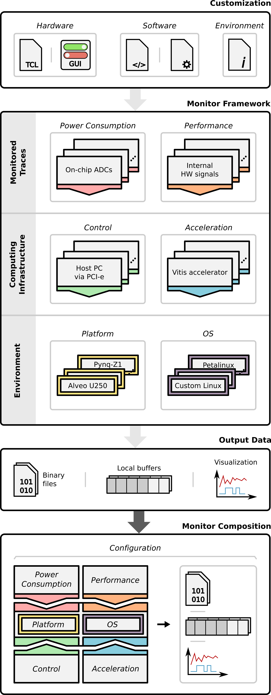

# Modular and Composable Monitoring Framework for FPGA-Based Systems

This repository contains the implementation of a modular and composable framework for power and performance monitoring in heterogeneous FPGA-based systems.

## Overview

Modern FPGA systems, especially in heterogeneous cloud-edge deployments, demand advanced monitoring solutions to enable efficient workload distribution, power-aware optimization, and system adaptability. This framework addresses key limitations of existing solutions by offering:

- **Modular architecture**: Easily configurable and extendable components for various platforms and applications.
- **Composable design**: Interchangeable monitoring components that adapt to specific hardware and software setups.
- **Power-performance synchronization**: High-resolution, timestamped traces for accurate analysis and visualization.
- **Cross-platform compatibility**: Supports multiple FPGA boards (e.g., Pynq-Z1, Kria KV260, Alveo U250, ZCU102, Genesys 2) and acceleration frameworks (e.g., Vitis, ARTICo3, MDC).

## Features

- Monitoring IP core with AXI interface for trace collection and control
- Power monitoring via on-chip ADCs or external SPI-based board (1 Msample/s)
- Customizable visualization tool for trace inspection
- Integration with diverse platforms, including bare-metal and Linux-based environments
- Validated across multiple configurations, from edge SoCs to cloud FPGA platforms

## Repository Structure

- `ip-core/`: Monitor hardware IP, which can be imported into a block design in Vivado.
- `constraints/`: Board constraint for the Monitor IP.
- `linux/`: Linux driver to interact with the hardware of the Monitor on a Linux-based system. For detailed information, refer to its [Readme](linux/drivers/monitor/readme.md).
- `device-tree/`: Device tree overlay to register the Monitor on a Linux-based system.
- `lib/`: Software user-space library to configure and manage the Monitor.
- `setup_monitor/`: Set of files and script to load the Linux driver and device tree overlay of the Monitor on the target platform. For detailed information, refer to its [Readme](setup_monitor/readme.md).
- `visualization/`: Python tool to visualize the traces acquired with the Monitor. For detailed information, refer to its [Readme](visualization/readme.md).
- `artico3_integration/`: Set of files and scripts to integrate the Monitor infrastructure into the [ARTICo3 framework](https://github.com/des-cei/artico3.git). For detailed information, refer to its [Readme](artico3_integration/readme.md).
- `demos/dummy/`: Tutorial showing a Linux application using the Monitor IP. For detailed information, refer to its [Readme](demos/dummy/readme.md).

## Supported Platforms (Tested)

| Platform        | OS            | Power Source       | Performance Source     | Acceleration |
|----------------|---------------|--------------------|-------------------------|--------------|
| Pynq-Z1         | Yocto-Linux   | External board     | Internal HW signals    | ARTICo³      |
| Kria KV260 SoM  | Custom Linux  | On-chip ADCs       | AXI bus                | MDC          |
| Alveo U250      | Petalinux     | Platform-specific  |                        | AMD Vitis    |
| ZCU102          | Bare-metal    |                    |                        |              |
| Genesys 2       |               |                    |                        |              |

These platforms have been thoroughly tested with the framework. However, the framework is not limited to these platforms and can be used with other FPGA-based systems as well.

## Getting Started

For a detailed tutorial on how to use the monitor, refer to the `demos/dummy` directory [(Readme)](demos/dummy/readme.md). It provides step-by-step instructions on what is required to use the monitor.
