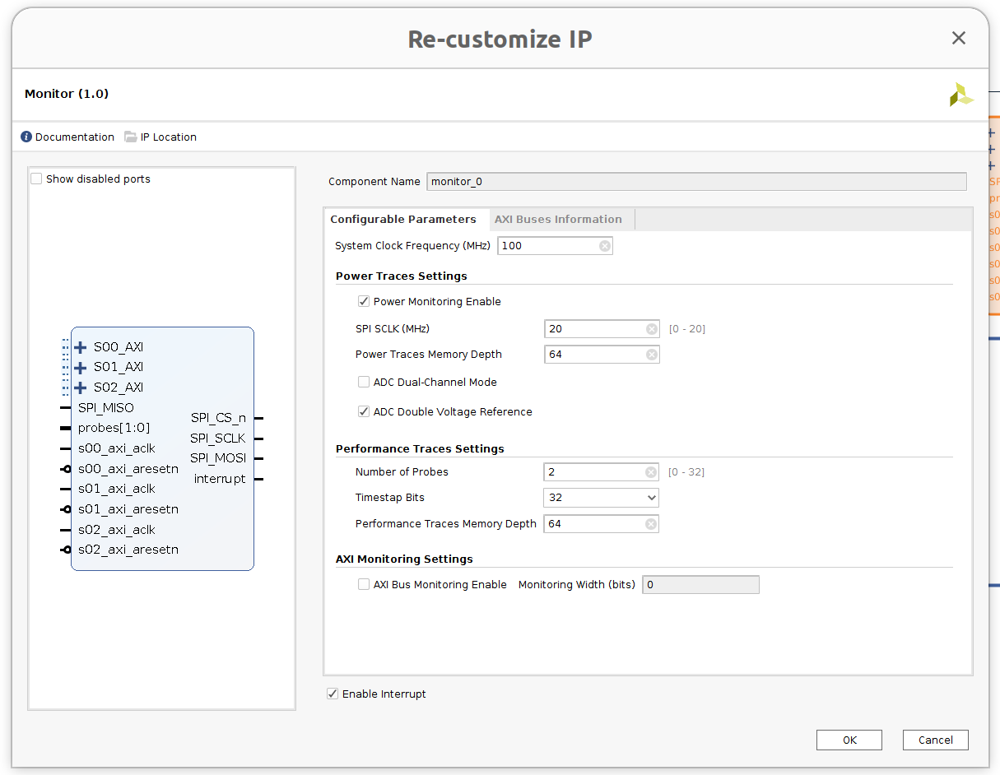
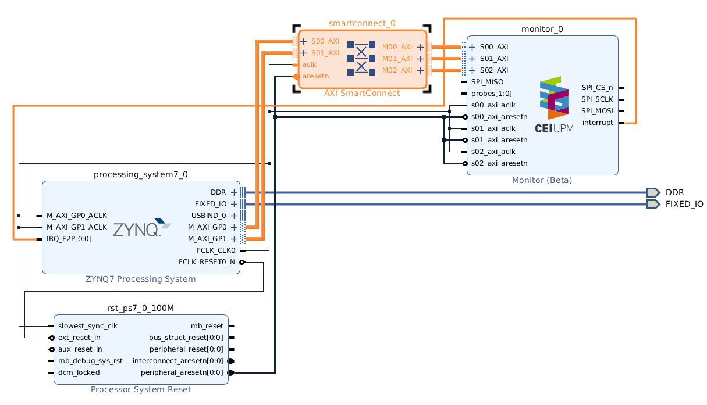
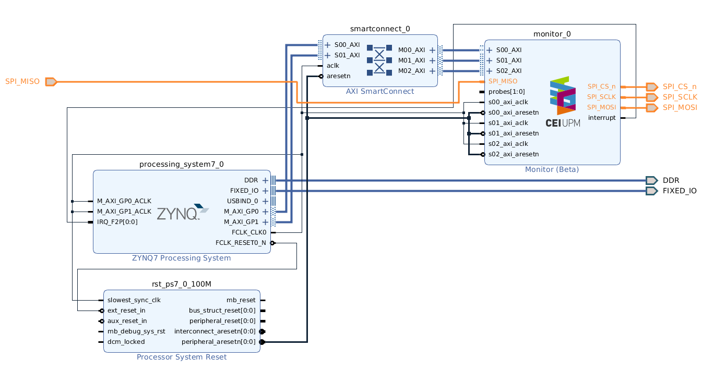
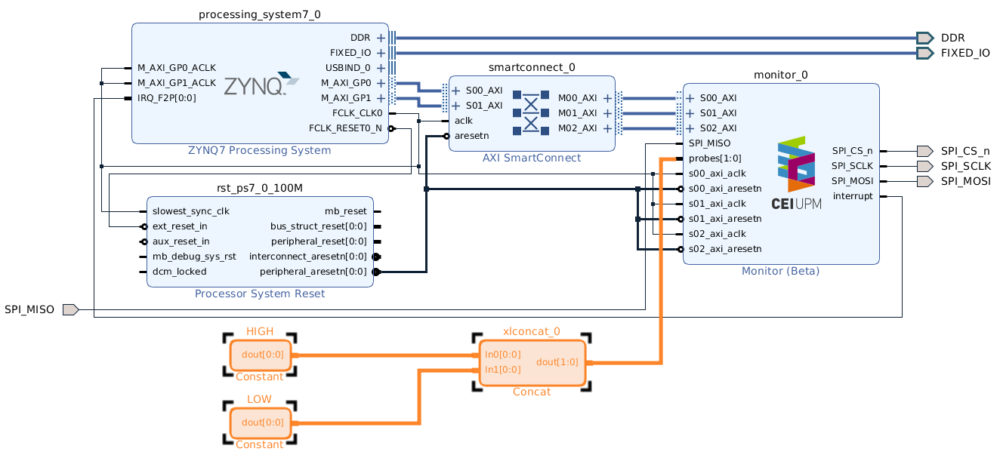
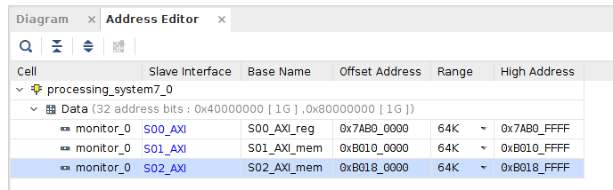
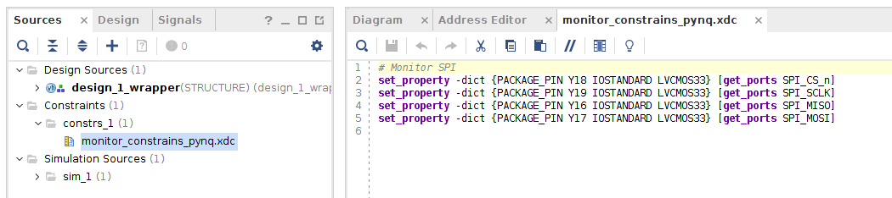
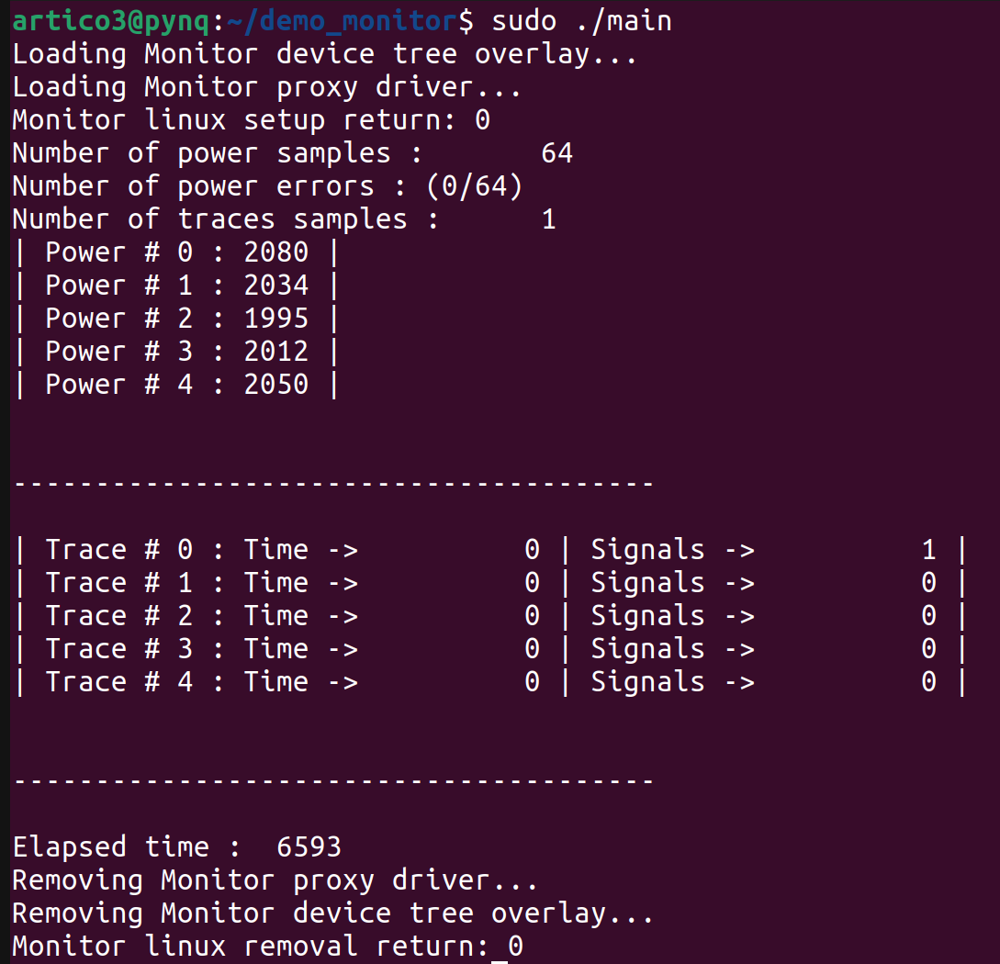
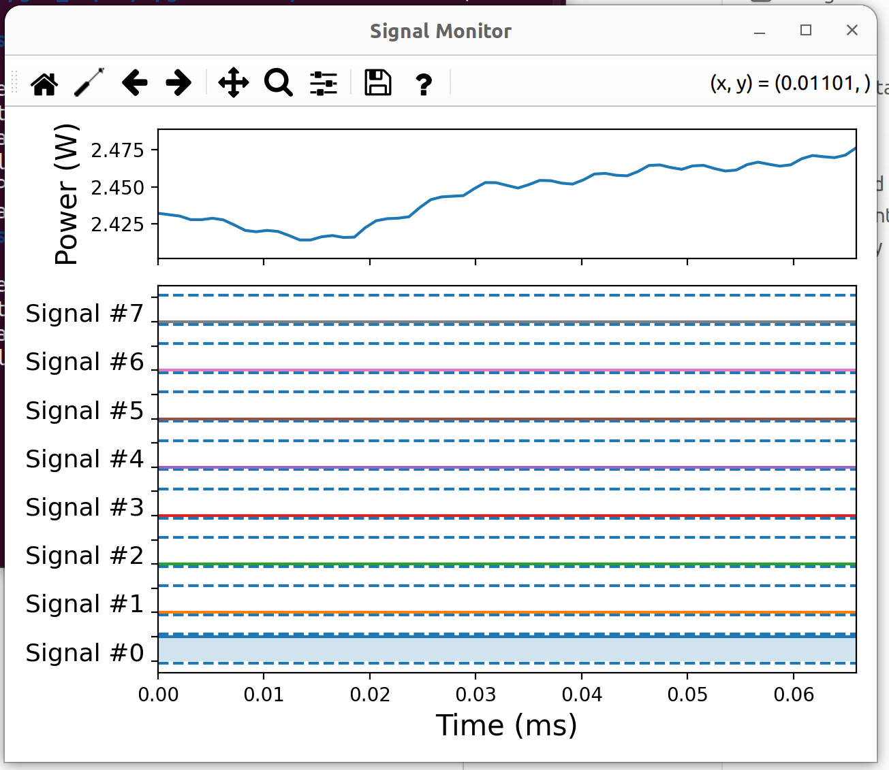

# Dummy Linux Application to Use the Monitor IP on a Vivado Design

## Introduction
This tutorial will guide you through the steps to add the Monitor IP to a Vivado design, configure it, generate the bitstream, and create a C application to use it from a Linux distribution. The compilation of the Linux driver of the Monitor and its device tree overlay will also be described.

## Prerequisites
- Xilinx Vivado installed
- Knowledge of Vivado, C programming and Linux
- A Linux distribution setup for development (the headers will be required to compile the Monitor Linux driver)

## Setup of this Tutorial
- ZYNQ Pynq-Z1 board
- CEI's measurement board for power trace acquisition

_A different setup might require platform-dependant modifications to this tutorial_

## Demo preparation

It is advice to copy this very same tutorial folder at `/fpga-monitor/demos/`, obtaining a development folder with the following structure:

```bash
/fpga-monitor
|- demos
   |- dummy
      |- hardware
      |- software
      |- setup_monitor
```

- **hardware**: Will contain the hardware design.
- **software**: will contain the Linux application.
- **setup_monitor**: Will contain the required Linux-related files (i.e., device tree overlay, Linux driver, installation scripts).


## Hardware Generation

### 1. Create a New Vivado Project
1. Open Vivado.
2. Click on **Create New Project**.
3. Follow the wizard to set up your project

   _Recommended location: `/fpga-monitor/demos/dummy/hardware`._

### 2. Add the Monitor IP to the Repository
1. In the Flow Navigator, click on **Settings**.
2. Navigate to **Project Settings > IP > Repository**.
3. Add the path to the Monitor IP (`/fpga-monitor/ip-core`) and click **OK**.

### 3 Create a New Block Design
1. In the Flow Navigator, click on **Create Block Design**.
2. Name your block design and click **OK**.
3. Add the necessary processing systems (e.g., Zynq, MicroBlaze) to your block design.
4. Connect the processing systems to the rest of your design using the block diagram editor.

### 4. Add the Monitor IP to the Design
1. In the Flow Navigator, click on **IP Catalog**.
2. Search for **Monitor** and double-click to add it to your design.
3. Double-click on the IP block to open the configuration dialog.
4. Set the parameters as required for your application.
    1. Indicate your design's clock frequency in the field **System Clock Frequency (MHz)**.
    2. Configure desired power settings in **Power Traces Settings** group.

        _Disable **Power Monitoring Enable** if CEI's external measurement board not in use._

    3. Configure desired performance settings in **Performance Traces Settings** group.

        In this tutorial, two dummy signals will be monitored. The **Number of Probes** field is modified accordingly.

    4. Enable AXI monitoring capabilities if desired by toggling **AXI Bus Monitoring Enable** (kept disabled).
    5. Configure interrupts in **Enable Interrupt** (enabled for this tutorial).
    6. Click **OK** to save the configuration.

    The configuration specific to this tutorial is the following:
    

5. Connect the Monitor to the processing system.
    1. Memory ports are recommended to be handled with an **AXI SmartConnect** IP.
    2. Connect the interupts signal.

    

6. Make SPI communication ports external (only if the CEI's measurement board is used).

    

7. Attach the signals to be monitored to the **probes** port.

    For this tutorial, a dummy example will be implemented. The signals to be monitored are a constant `"01"` vector.

    

### 5. Set the Memory Addresses of the Monitor
1. Open the **Address Editor** tab on the current block diagram.
2. Select the desired memory address range for each memory port.

    It is strongly recommended to keep it as shown in this tutorial Otherwise, changes in the Monitor library and device tree node will be required.

    

### 6. Include the Board Constraints for the SPI Communication
This is required only when the CEI's measurement board is used (i.e., SPI ports are needed).

This tutorial uses a PYNQ-Z1 board. The constraints found in `../constraints/monitor_constraints_pynq.xdc` has been used.



### 7. Generate the Bitstream
1. In the Flow Navigator, click on **Generate Bitstream**.
2. Wait for the process to complete.
3. Depending on your target platform, a certain bitstream format will be required by the FPGA Manager ([ZYNQ](https://xilinx-wiki.atlassian.net/wiki/spaces/A/pages/18841645/Solution+Zynq+PL+Programming+With+FPGA+Manager) | [ZYNQMP](https://xilinx-wiki.atlassian.net/wiki/spaces/A/pages/18841847/Solution+ZynqMP+PL+Programming))

   Since the target platform in this tutorial is the ZYNQ Pynq-Z1 board, the following format conversion needs to be performed:

   ```bash
   vivado -mode tcl

   [vivado]

   write_cfgmem -force -disablebitswap -interface SMAPx32 -format BIN -loadbit "up 0x0 design_1_wrapper.bit" design_1_wrapper.bin
   ```
4. Copy the `design_1_wrapper.bin` file to `/fpga-monitor/demos/dummy/hardware` for convenience.

## Linux Application

### 1. Compile the Monitor Linux driver
Certain operations cannot be perform from user space (e.g., continuous physical memory allocation, required for DMA transfers). Linux kernel modules are used to perform those operations from kernel space. This Linux kernel modules, know as Linux drivers, are installed in the kernel in order to instruct it on how to manage a particular device.

A Linux driver for the Monitor has been made available. It requires to be compiled for the specific kernel version used on your system.

1. Navigate to `/fpga-monitor/linux/drivers/monitor`, and open a new **Terminal**.
2. Set up the cross-compilation environment (adapt it to your system):
    ```bash
    export CROSS_COMPILE="arm-linux-gnueabihf-"
    export ARCH="arm"
    export KDIR="path-to-linux-headers"
    ```
3. Compile the Monitor Linux driver:
    ```sh
    make
    ```
    A `mmonitor.ko` file containing the compiled Monitor Linux driver should have been generated. This file will be used later as the driver for the Monitor in the Linux system.

4. Copy the `mmonitor.ko` file to `/fpga-monitor/demos/dummy/setup_monitor/modules`.

### 2. Compile the Monitor device tree overlay
The Linux kernel needs certain pieces of information to access the Monitor in hardware (e.g., memory address, interrupt ID). This information has to be included in the Linux device tree as a new node.

In this tutorial an overlay modifies system's device tree at run time. Alternatively, the node could be added to the system's device tree beforehand.
1. Navigate to the device tree folder at `/fpga-monitor/device-tree`.
2. Make a copy of the folder that better fits your platform (in this case `overlay-pynq` will be used).
3. Modify the Monitor device tree node (`monitor.dts) based on you hardware.

    _Could be the one already in the folder in case you used the same addresses as this tutorial in [this step](#5-set-the-memory-addresses-of-the-monitor)._
4. Open a **Terminal** in `/fpga-monitor/device-tree/<your-overlay-folder>`, and compile the device tree overlay.

    ```bash
    make
    ```

    A `monitor.dtbo` file should have been created. This file will be used later to modify the Linux device tree.

    _Note: Requires `device-tree-compiler`package installed._

    _`sudo apt-get install device-tree-compiler`_

5. Copy the `monitor.dtbo` file to `/fpga-monitor/demos/dummy/setup_monitor/overlays`.

### 3. Create and Build the Linux Application

1. Create a `C` application for your design.

   The recomendation is to use the project at `/fpga-monitor/demos/dummy/software` as the template for your application.

2. Open a **Terminal** at `/fpga-monitor/demos/dummy/software`.
3. Set up the cross-compilation environment (adapt it to your system).
    ```bash
    export CROSS_COMPILE="arm-linux-gnueabihf-"
    ```
4. Compile the application
   ```bash
   make
   ```

   A `main` application should have been created among other more advanced files.


### 4. Transfer Required Files to the Target Linux System
1. Copy the generated hardware bitstream file (`.bin`) to the target Linux system.
2. Copy the compiled software application (`main`) to the target Linux system.
3. Copy the `setup_monitor` folder, which contains the `mmonitor.ko` and `monitor.dtbo` files, to the target Linux system.

You can use `scp` or any other file transfer method to copy the files. For example:
```bash sh
scp /fpga-monitor/demos/dummy/hardware/design_1_wrapper.bin user@target:/path/to/destination
scp /fpga-monitor/demos/dummy/software/main user@target:/path/to/destination
scp -r /fpga-monitor/demos/dummy/setup_monitor user@target:/path/to/destination
```

### 5. Run the Application in the OS

1. Run on target the `setup_monitor/monitor_init.sh`script. It will copy the kernel module and overlay to their appropriate location on OS filesystem.
   ```bash
   ./setup_monitor/monitor_init.sh
   ```
2. Load on target the hardware bitstream. Check the procedure for your target platform (e.g., [ZYNQ](https://xilinx-wiki.atlassian.net/wiki/spaces/A/pages/18841645/Solution+Zynq+PL+Programming+With+FPGA+Manager), [ZYNQMP](https://xilinx-wiki.atlassian.net/wiki/spaces/A/pages/18841847/Solution+ZynqMP+PL+Programming))

   In the case of this tutorial:
   ```bash
   cp design_1_wrapper.bin /lib/firmware
   echo design_1_wrapper.bin > /sys/class/fpga_manager/fpga0/firmware
   ```
3. Run on target the user application
   ```bash
   ./main
   ```
4. The output on the target platform should be something similar to this:
    
5. The `CON.BIN` and `SIG.BIN` generated in the target platform can be visualized with the visualization tool presented [here](../../visualization/). The output for this dummy example is the following:

    

    Observe the signals #0 and #1 have the expected `HIGH` and `LOW` values, respectively.


## Conclusion
You have successfully added the Monitor IP to a Vivado design, configured it, generated the bitstream, and created a dummy C application to use it from a Linux distribution.

## Reference
For more detailed information about each component of the Monitor, please refer to the repository [Readme](../../readme.md)
